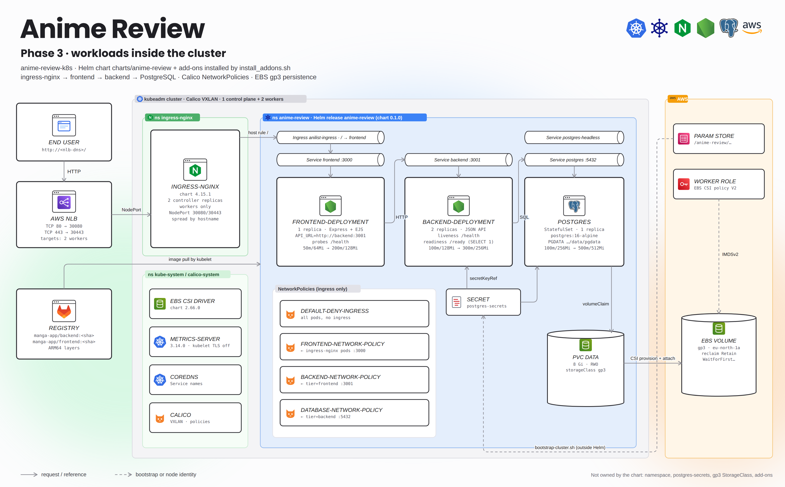
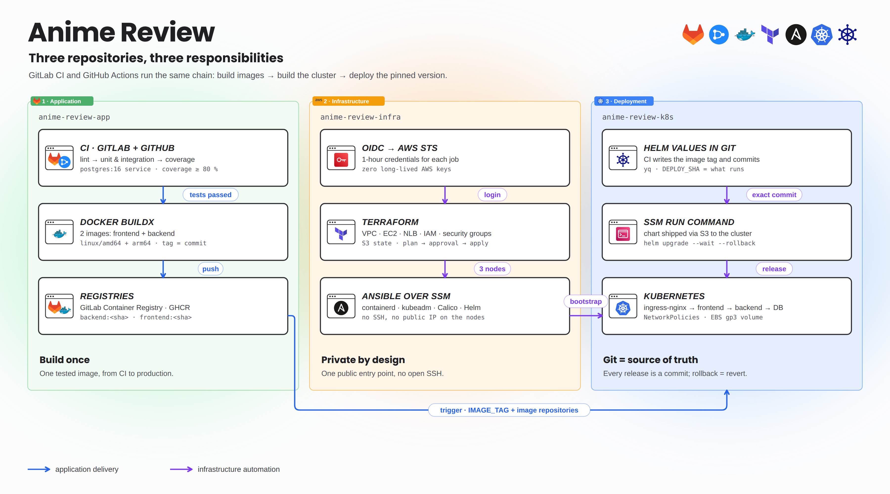
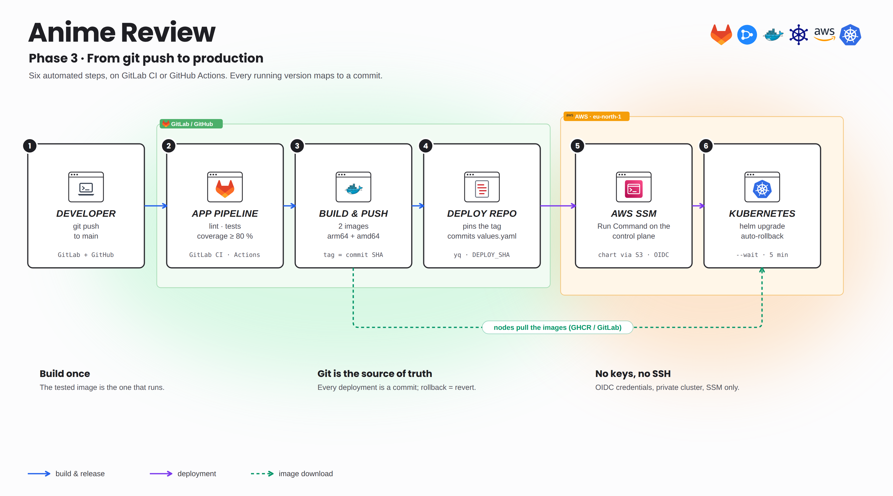
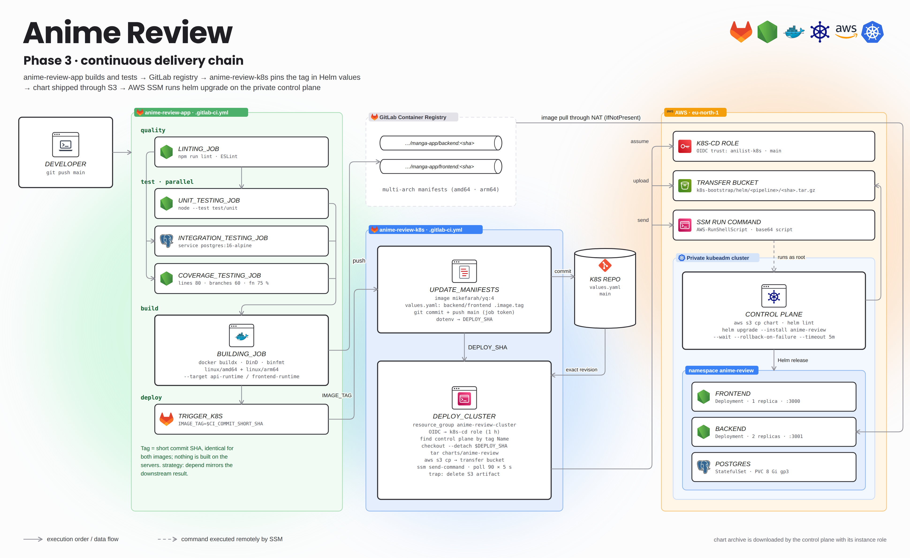
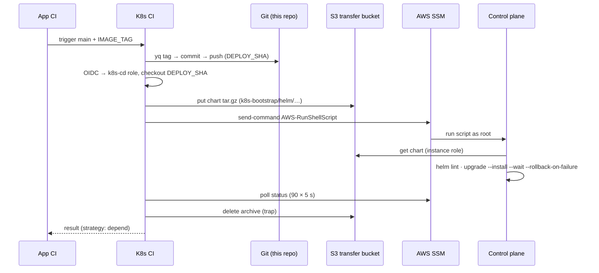

# Anime Review · Kubernetes delivery (Helm)

This repository installs the cluster add-ons and deploys the application as the **`anime-review` Helm release** on the private kubeadm cluster built by [anime-review-infra](https://github.com/Songhai9/anime-review-infra). Images come from [anime-review-app](https://github.com/Songhai9/anime-review-app). Every deployment is executed **on the control plane through AWS Systems Manager**: the cluster API is never exposed, and neither GitLab CI nor GitHub Actions holds a kubeconfig or an AWS key.


<details>
<summary><b>Detailed view</b> (every component, port and job)</summary>



</details>



## Implemented DevOps features

**Helm chart `charts/anime-review`** (chart `0.1.0`, 12 objects with default values)
- `frontend-deployment` (1 replica, :3000) and `backend-deployment` (2 replicas, :3001), each with a ClusterIP Service, resource requests/limits, liveness `/health`, backend readiness `/ready` (runs `SELECT 1`).
- PostgreSQL 16 `StatefulSet` with a headless Service, a ClusterIP Service and an 8 Gi `gp3` volume claim (RWO). Password read from the `postgres-secrets` Secret, never from values.
- Ingress `anilist-ingress` (class `nginx`, `/` → `frontend:3000`).
- Four NetworkPolicies enforced by Calico: default deny ingress, then only ingress-nginx → frontend :3000 → backend :3001 → database :5432.
- Image tags, replicas, resources, ports, Ingress and policies are values; tags are the only thing CI changes.

**Cluster add-ons** (`install_addons.sh`, pinned chart versions)
- AWS EBS CSI driver `2.66.0` on the workers (uses the worker instance role through IMDSv2).
- ingress-nginx `4.15.1`: 2 replicas on workers only, spread by hostname, NodePort 30080/30443 behind the AWS NLB.
- metrics-server `3.14.0` (`kubectl top`).
- `gp3` StorageClass: `WaitForFirstConsumer`, `reclaimPolicy: Retain`.

**Secrets and bootstrap** (`bootstrap-cluster.sh`)
- Reads `/anime-review/postgres/password` from SSM Parameter Store with the control-plane role and creates `postgres-secrets` idempotently (`--dry-run=client | kubectl apply`). The password never appears in Git or CI logs.

**Continuous delivery** (GitLab CI `.gitlab-ci.yml` and GitHub Actions `deploy.yml`)
- Triggered by the application pipeline (GitLab multi-project trigger or GitHub `workflow_dispatch`) with the image tag: `yq` pins the tag in `values.yaml`, commits and pushes to `main`, and passes the resulting `DEPLOY_SHA` through a dotenv artifact.
- `deploy_cluster` assumes the `k8s-cd` role with OIDC, finds the control plane by tag, checks out the exact `DEPLOY_SHA`, uploads the chart archive to S3, runs `helm lint` + `helm upgrade --install --wait --rollback-on-failure` through `ssm send-command`, streams the result and deletes the S3 object.
- Git is the source of truth: a push on `main` redeploys the current chart. `resource_group` serializes deployments.



<details>
<summary><b>Detailed view</b> (every component, port and job)</summary>



</details>

## Repository layout

| Path | Content |
|---|---|
| `charts/anime-review/` | Helm chart (templates + `values.yaml`, the desired state) |
| `addons/*/values.yaml` | Values for EBS CSI, ingress-nginx, metrics-server |
| `install_addons.sh` | Installs/upgrades the three add-ons |
| `bootstrap-cluster.sh` | Add-ons → namespace → Secret → StorageClass → Helm release |
| `namespace/anime-review.yaml` | Namespace (outside the chart) |
| `storage/gp3-storageclass.yaml` | StorageClass (cluster-scoped, outside the chart) |
| `.gitlab-ci.yml` | GitLab CI: `update_manifests` + `deploy_cluster` |
| `.github/workflows/deploy.yml` | GitHub Actions: same delivery + `bootstrap_cluster` path |
| `docs/` | Configuration, operations, examples, diagrams |

`storage/postgres-secrets.yaml` is git-ignored on purpose: the real Secret is always generated from Parameter Store.

## Before you deploy

| # | Prerequisite | Provided by |
|---|---|---|
| 1 | 3 `Ready` nodes, Calico, Helm 4 and AWS CLI on the control plane | [anime-review-infra](https://github.com/Songhai9/anime-review-infra) |
| 2 | NLB forwarding 80/443 to NodePorts 30080/30443 | anime-review-infra |
| 3 | SecureString `/anime-review/postgres/password` (eu-north-1) | you, once ([infra › BOOTSTRAP-AWS §6](https://github.com/Songhai9/anime-review-infra/blob/main/docs/BOOTSTRAP-AWS.md)) |
| 4 | `k8s-cd` IAM role (output `k8s_cd_arn`) trusting this repository's `main` branch on GitLab and GitHub | anime-review-infra Terraform |
| 5 | Transfer bucket with prefix `k8s-bootstrap/` readable by the control plane | infra `bootstrap/` + Terraform |
| 6 | Backend and frontend images for **arm64**, same tag (GHCR or GitLab registry) | anime-review-app CI |
| 7 | If the registry is private: a pull token (`read_registry` deploy token, or a GHCR token with `read:packages`) | GitLab / GitHub |

### GitLab configuration of this project

| Setting | Value |
|---|---|
| Variable `AWS_ROLE_ARN` (protected) | `terraform -chdir=terraform output -raw k8s_cd_arn` in the infra repo |
| `K8S_TRANSFER_BUCKET`, `AWS_REGION` | edit in `.gitlab-ci.yml` if your names differ |
| Job token permissions | allow **anime-review-app** (and anime-review-infra for bootstrap) to trigger pipelines |
| Job token → *Allow Git push requests* | enabled, so `update_manifests` can push to `main` |
| `charts/anime-review/values.yaml` | `backend.image.repository` / `frontend.image.repository` set to **your** registry paths |

A checklist version is in [`docs/examples/gitlab-ci-variables.env.example`](docs/examples/gitlab-ci-variables.env.example).

### GitHub Actions configuration of this repository

| Setting | Value |
|---|---|
| Variables `AWS_ROLE_ARN`, `AWS_REGION`, `K8S_TRANSFER_BUCKET` | `k8s_cd_arn` output · `eu-north-1` · transfer bucket |
| Workflow permissions | `contents: write` (values commit) and `id-token: write` (OIDC) are declared in `deploy.yml` |
| Branch protection on `main` | must let `github-actions[bot]` push the values commit |
| Callers | app and infra dispatch `deploy.yml` with their `K8S_WORKFLOW_TOKEN` secret |

Checklist: [`docs/examples/github-actions.env.example`](docs/examples/github-actions.env.example).

## First installation (bootstrap)

Prerequisite: the infra repository has finished its Ansible step (three `Ready` nodes, plus AWS CLI, kubectl and Helm on the control plane). `bootstrap-cluster.sh` must run **on the control plane** because it uses `/etc/kubernetes/admin.conf`, `aws`, `kubectl` and `helm`. It runs, in order:

```
install_addons.sh                          → EBS CSI, ingress-nginx, metrics-server
namespace/anime-review.yaml                → namespace
Parameter Store /anime-review/postgres/password → Secret postgres-secrets
storage/gp3-storageclass.yaml              → StorageClass gp3
helm upgrade --install anime-review        → PostgreSQL, backend, frontend, ingress, NetworkPolicies
```

There are three ways to get it there. None of them uses SSH.

### Option A · From the pipeline (recommended)

GitHub: *Actions → Kubernetes CD → Run workflow*, check `bootstrap_cluster` and leave `image_tag` empty. From a terminal:

```bash
gh workflow run deploy.yml -R Songhai9/anime-review-k8s -f bootstrap_cluster=true
```

The infra pipeline does the same thing automatically after a rebuild. GitLab currently has no job for `BOOTSTRAP_CLUSTER` (see [Continuous delivery](#continuous-delivery)).

### Option B · From your workstation, same mechanism as the CI

```bash
. ~/.config/anime-review/operator.env        # AWS profile + ANSIBLE_SSM_BUCKET
bash docs/examples/bootstrap-via-ssm.sh.example
```

The script ([`docs/examples/bootstrap-via-ssm.sh.example`](docs/examples/bootstrap-via-ssm.sh.example)) does the following:

1. It reads the control-plane instance ID from `../anime-review-infra/terraform`.
2. It archives this repository (without `.git`, including uncommitted changes) and uploads it to `s3://$ANSIBLE_SSM_BUCKET/k8s-bootstrap/local/<sha>.tar.gz`.
3. It sends `AWS-RunShellScript` to the control plane. That script downloads and extracts the archive, exports `KUBECONFIG`, runs `bootstrap-cluster.sh` and cleans up.
4. It polls the command, prints stdout/stderr and deletes the S3 object.

This is the direct replacement for the old `scp` + `ssh`.

### Option C · Interactive session (debugging)

```bash
CONTROL_PLANE_ID=$(terraform -chdir=../anime-review-infra/terraform output -raw control_plane_instance_id)
aws ssm start-session --target "$CONTROL_PLANE_ID" --region eu-north-1
```

On the node, run `sudo -i` and `export KUBECONFIG=/etc/kubernetes/admin.conf`. Then get the repository (`git clone https://github.com/Songhai9/anime-review-k8s.git`, which goes out through the NAT) and run `./bootstrap-cluster.sh`.

`bootstrap-cluster.sh` is idempotent. It still uses `helm … --atomic`, whereas the CI chart deployment uses `--rollback-on-failure`, the Helm 4 name. If your Helm build rejects `--atomic`, run the steps by hand:

```bash
bash ./install_addons.sh
kubectl apply -f namespace/anime-review.yaml
kubectl create secret generic postgres-secrets -n anime-review \
  --from-literal=POSTGRES_PASSWORD="$(aws ssm get-parameter --name /anime-review/postgres/password \
     --with-decryption --query Parameter.Value --output text --region eu-north-1)" \
  --dry-run=client -o yaml | kubectl apply -f -
kubectl apply -f storage/gp3-storageclass.yaml
helm upgrade --install anime-review ./charts/anime-review -n anime-review \
  --server-side=true --wait --rollback-on-failure --timeout 5m
```

### Private registry only · pull Secret

If the images are not public, create the pull Secret once before the first release, from an SSM session (option C):

```bash
kubectl apply -f namespace/anime-review.yaml
read -r -p 'Registry username: ' U; read -r -s -p 'Registry token: ' P; echo
kubectl create secret docker-registry gitlab-registry -n anime-review \
  --docker-server=registry.gitlab.com --docker-username="$U" --docker-password="$P" \
  --dry-run=client -o yaml | kubectl apply -f -
unset P
kubectl apply -f docs/examples/registry-serviceaccount.yaml.example
```

### Verify end to end

From an SSM session on the control plane (option C), with `KUBECONFIG=/etc/kubernetes/admin.conf`:

```bash
kubectl get nodes -o wide                       # 3 nodes Ready
kubectl get pods -A                             # ingress-nginx, ebs-csi, metrics-server, calico Running
helm status anime-review -n anime-review        # STATUS: deployed
kubectl -n anime-review get pods,svc,ingress,pvc,networkpolicy
kubectl -n anime-review rollout status deployment/backend-deployment
kubectl -n anime-review rollout status deployment/frontend-deployment
kubectl -n anime-review rollout status statefulset/postgres
```

From your workstation (infra repo): `curl --fail "http://$(terraform -chdir=terraform output -raw nlb_dns_name)/health"`, then open the site, create a reader and a review, reload. That path crosses NLB → ingress-nginx → frontend → backend → PostgreSQL.

## Continuous delivery

Two equivalent implementations: GitLab CI (`.gitlab-ci.yml`, jobs `update_manifests` + `deploy_cluster`) and GitHub Actions (`.github/workflows/deploy.yml`, one `deploy` job). Both serialize deployments (`resource_group` / `concurrency: anime-review-cluster`).

| Triggered by | What happens | GitLab CI | GitHub Actions |
|---|---|---|---|
| App pipeline with an image tag | pin tag (GitHub: also repository) with `yq`, commit, deploy that commit with Helm | ✅ `IMAGE_TAG` | ✅ `workflow_dispatch` inputs `image_tag`, `backend_repository`, `frontend_repository` |
| Push to `main` touching the chart | deploy the pushed commit | ✅ any push | ✅ `charts/**`, scripts, `namespace/**`, `storage/**` |
| Infra pipeline, fresh cluster | ship the whole repo and run `bootstrap-cluster.sh` via SSM | ❌ no job (see below) | ✅ input `bootstrap_cluster: true` |



**Change something else than the image:** edit the chart or `values.yaml` and push to `main`. Add-ons, namespace, Secret and StorageClass are outside the release: rerun the relevant part of `bootstrap-cluster.sh`.

**Roll back:** revert the `CI/CD - update Helm values for …` commit and push. Check database schema compatibility first; Helm never rolls back data.

> [!WARNING]
> **GitLab only: automatic bootstrap is not wired.** GitHub Actions handles `bootstrap_cluster`. On GitLab, anime-review-infra's `bootstrap_k8s` job triggers this project with `BOOTSTRAP_CLUSTER=true`, but the job that consumed it was dropped in commit `726bb49`, so the downstream pipeline has no job.
>
> Also note: the GitLab `update_manifests` job changes **tags only**. Since `values.yaml` now points to GHCR, a GitLab-only delivery deploys the GHCR image with the GitLab commit tag; it works because both platforms tag with the same short SHA, but only if GitHub built it. A proposal (the job as it existed before `726bb49`) is in [`docs/examples/bootstrap-job.gitlab-ci.yml.example`](docs/examples/bootstrap-job.gitlab-ci.yml.example): append it to `.gitlab-ci.yml`.

## Configuration and operations

- [Values, identities and tokens](docs/CONFIGURATION.md)
- [Diagnostics, backups, rollback](docs/OPERATIONS.md)
- [Example Helm override](docs/examples/helm-values.yaml.example) · [operator shell variables](docs/examples/deployment.env.example)
- [Diagrams](docs/assets/README.md) · the AWS side is shown in [03-kubernetes](docs/assets/03-kubernetes.png)

## Known limits

Single control plane and single PostgreSQL pod (no HA, no automated backup). No HPA. No TLS certificate: port 443 is forwarded but serves nothing useful. NetworkPolicies filter ingress only. This is push-based CD, not a GitOps controller: a manual `helm upgrade` is not reconciled back to Git.
