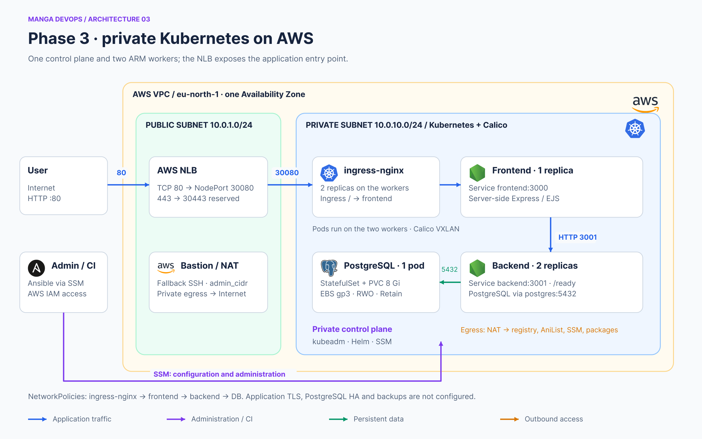
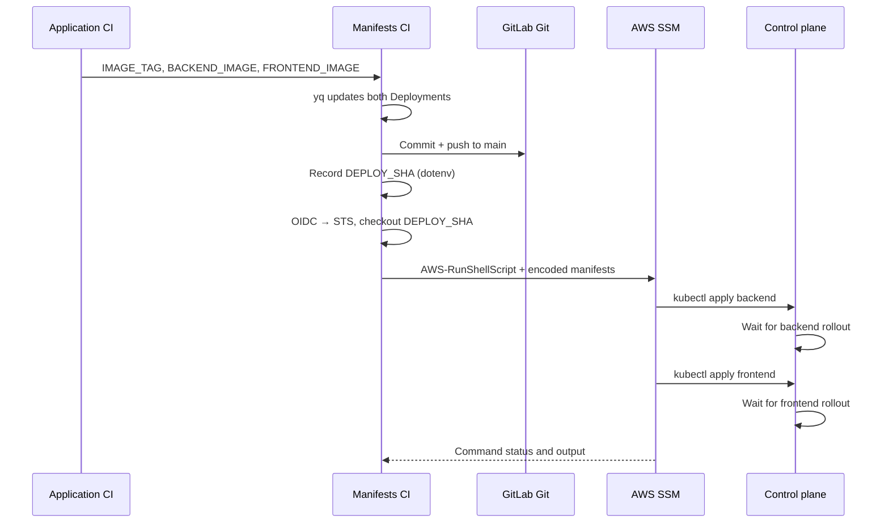

# Anime Review · Kubernetes and application delivery

This repository installs Kubernetes components and deploys a three-tier application on an AWS kubeadm cluster: Express/EJS frontend, Express API and PostgreSQL 16 on EBS. It also versions the image references delivered by application CI.



## Documentation

- [Installation and delivery](#installation-and-delivery)
- [Configuration and secrets](docs/CONFIGURATION.md)
- [Checks, troubleshooting and rollback](docs/OPERATIONS.md)

This repository is dedicated to Kubernetes. Its README covers initial installation and subsequent updates.

[anime-review-infra](https://github.com/Songhai9/anime-review-infra) creates the cluster. [anime-review-app](https://github.com/Songhai9/anime-review-app) builds the images. Follow the infra procedure first: this repository does not create the VPC or nodes.

## Implemented features

- Repeatable installation of EBS CSI, ingress-nginx and metrics-server Helm charts, with explicit chart versions and values files.
- `anime-review` namespace, SQL Secret sourced from an AWS Parameter Store SecureString, and environment-based configuration.
- PostgreSQL StatefulSet, headless Service for identity and `postgres` Service for application access; 8 GiB RWO PVC, gp3 StorageClass, `WaitForFirstConsumer`, `Retain` and a `PGDATA` subdirectory.
- One frontend replica, two backend replicas, internal Services and an Ingress targeting the frontend. The browser does not directly access the API.
- Requests/limits, liveness and readiness probes; API readiness depends on a SQL query.
- Default-deny ingress policy with permissions for ingress-nginx → frontend → backend → DB. These policies do not deny egress.
- Two ingress-nginx pods spread across workers through a topology constraint. Backend replicas do not have the same spreading constraint.
- GitLab pipeline: update both images, commit to Git, forward `DEPLOY_SHA`, authenticate to AWS through OIDC, run SSM Run Command, apply and check both Deployments.

## Initial installation versus routine delivery

`bootstrap-cluster.sh` installs add-ons, retrieves the password, creates resources and waits for workloads. **The CD pipeline does not run this script**: it reapplies only the two Deployments. Changes to Services, NetworkPolicies, Ingress or storage must be applied separately.

Do not run bootstrap before following the [detailed prerequisites](#1-gather-prerequisites): kubeconfig, AWS CLI on the administration machine, SSM parameter, permissions, published images and private-registry credentials.

## Useful paths

| Path | Contents |
|---|---|
| `install_addons.sh`, `addons/` | Charts, versions and values |
| `bootstrap-cluster.sh` | Initial application installation |
| `namespace/` | Application namespace |
| `storage/` | StorageClass, StatefulSet and PostgreSQL Services |
| `backend/`, `frontend/` | Deployments and Services |
| `ingress/` | External routing to frontend |
| `networking/` | Ingress filtering between tiers |
| `.gitlab-ci.yml` | Image commits and deployment through SSM |

## Limitations and component status

One control plane, one AZ, one frontend and one PostgreSQL instance: the complete architecture is not highly available. There is no automated SQL backup/restore, HPA, PDB, migration Job, automatic rollback or continuous Argo CD/Flux reconciliation.

NLB port 443 is prepared, but the supplied Ingress has no configured application TLS/certificate. Metrics-server uses `--kubelet-insecure-tls`; it does not provide historical monitoring. The community **ingress-nginx controller retired in March 2026**. These manifests document the project's implementation and require migration to a maintained controller before a new long-term deployment. [Kubernetes announcement](https://kubernetes.io/blog/2026/01/29/ingress-nginx-statement/).

Source checked on September 29, 2026: `ea4c10677d3aa0a62e4731afa8895ca2f1d84d0b`. Code presence does not prove current cluster availability or a successful deployment performed today.

[Detailed sources and documented revision](docs/SOURCES.md).

## Installation and delivery

### 1. Gather prerequisites

- Complete the infra repository's cluster guide: three Ready nodes, working Calico, Helm on the control plane and a provisioned NLB.
- The operator can open an SSM session to the control plane and use `sudo`. The local profile has the required permissions; instances are SSM Online.
- Both backend/frontend images come from the same commit and are published for ARM64 in the expected registry. The original manifests' `:204a33c5` tag does not guarantee availability in your registry.
- SecureString `/anime-review/postgres/password` exists in Parameter Store in eu-north-1. The bootstrap identity can read and decrypt it.
- For a private registry, obtain a `read_registry` deploy token and its username, and configure a pull Secret before creating Deployments.

The following steps use the control plane as the administration machine, so the private Kubernetes API does not need Internet exposure.

### 2. Open a session and prepare tools

From the infra repository root on your workstation:

```bash
CONTROL_PLANE_ID=$(terraform -chdir=terraform output -raw control_plane_instance_id)
aws ssm start-session --target "$CONTROL_PLANE_ID" --region eu-north-1
```

Inside the remote machine's session:

```bash
sudo -i
export KUBECONFIG=/etc/kubernetes/admin.conf
export AWS_REGION=eu-north-1
export AWS_DEFAULT_REGION=eu-north-1
kubectl get nodes -o wide
helm version
command -v aws
```

If AWS CLI v2 is absent, install the Linux ARM64 version on these ARM EC2 instances. Example manual preparation—an operational addition, not included in current playbooks:

```bash
apt-get update
apt-get install -y curl unzip git
curl --fail --location 'https://awscli.amazonaws.com/awscli-exe-linux-aarch64.zip' \
  --output /tmp/awscliv2.zip
unzip -q /tmp/awscliv2.zip -d /tmp
/tmp/aws/install
aws --version
```

If AWS CLI already exists, do not rerun the block blindly; check its version and the appropriate update procedure. Verify identity and parameter access without displaying the secret value:

```bash
aws sts get-caller-identity
aws ssm get-parameter --name /anime-review/postgres/password \
  --with-decryption --region eu-north-1 --query Parameter.Name --output text
```

The control-plane instance profile already includes Parameter Store access through `AmazonSSMManagedInstanceCore`. For access failures, also inspect KMS/SCP rules rather than automatically adding broad permissions. Do not copy permanent workstation AWS keys onto the VM.

### 3. Retrieve manifests and choose images

On the control plane, in your chosen administration directory:

```bash
git clone https://github.com/Songhai9/anime-review-k8s.git
cd anime-review-k8s
export BACKEND_IMAGE='registry.gitlab.com/YOUR_GROUP/YOUR_APP/backend:YOUR_TAG'
export FRONTEND_IMAGE='registry.gitlab.com/YOUR_GROUP/YOUR_APP/frontend:YOUR_TAG'
# Update local manifests BEFORE bootstrap, without changing the cluster:
kubectl set image --local -f backend/backend-deployment.yaml \
  anilist-backend="$BACKEND_IMAGE" -o yaml > /tmp/manga-backend.yaml
kubectl set image --local -f frontend/frontend-deployment.yaml \
  anilist-frontend="$FRONTEND_IMAGE" -o yaml > /tmp/manga-frontend.yaml
cp /tmp/manga-backend.yaml backend/backend-deployment.yaml
cp /tmp/manga-frontend.yaml frontend/frontend-deployment.yaml
```

Replace URLs with your fork when appropriate. For the exact documented version, check out `ea4c10677d3aa0a62e4731afa8895ca2f1d84d0b` before changing image references. A public checkout avoids installing a human Git token on the control plane. CI subsequently uses GitLab, so paths and manifests must remain consistent across the two repositories.

### 4. Private registry access

Skip this step only if images are public and genuinely accessible anonymously. Otherwise, create the namespace, then the Secret, and associate it with the ServiceAccount used by pods:

```bash
kubectl apply -f namespace/anime-review.yaml
read -r -p 'Deploy token username: ' REGISTRY_USER
read -r -s -p 'read_registry deploy token: ' REGISTRY_PASSWORD
printf '\n'
kubectl create secret docker-registry gitlab-registry \
  --namespace anime-review \
  --docker-server=registry.gitlab.com \
  --docker-username="$REGISTRY_USER" \
  --docker-password="$REGISTRY_PASSWORD" \
  --dry-run=client -o yaml | kubectl apply -f -
unset REGISTRY_PASSWORD
kubectl patch serviceaccount default -n anime-review \
  --type=merge -p '{"imagePullSecrets":[{"name":"gitlab-registry"}]}'
```

The association applies to newly created pods using the default ServiceAccount. Recreate existing pods through a controlled rollout after fixing the configuration. This command replaces the `imagePullSecrets` list; preserve any other entries in an existing environment. The optional manifest under `docs/examples/` documents the same association; bootstrap does not load it automatically.

### 5. Run the initial installation

Still in the K8s repository on the control plane, with `KUBECONFIG` exported:

```bash
chmod +x bootstrap-cluster.sh install_addons.sh
./bootstrap-cluster.sh
```

The script performs the following sequence:

1. Read the SQL SecureString with AWS CLI and reject an empty value.
2. Install EBS CSI (chart 2.66.0), ingress-nginx (4.15.1) and metrics-server (3.14.0), using their values files, `helm upgrade --install`, waits and timeouts.
3. Apply the namespace, then create/update `postgres-secrets` with the retrieved value.
4. Apply the gp3 StorageClass, PostgreSQL StatefulSet and Service, then wait for the database.
5. Apply backend and wait for rollout, then frontend and wait for rollout.
6. Apply Ingress and NetworkPolicies.

Chart versions are those in the repository. Community ingress-nginx has retired; read the root README note before using it in a long-term environment. NetworkPolicies are applied at the end, so a first installation can briefly operate without this application-level filtering.

Bootstrap is not atomic. If a step fails, previously applied resources remain. Diagnose the blocked component before rerunning, especially for PostgreSQL-related changes.

### 6. Check networking, application and data

```bash
kubectl get nodes -o wide
helm list -n kube-system
helm list -n ingress-nginx
kubectl -n anime-review get pods,svc,ingress,pvc
kubectl get pv
kubectl -n anime-review get networkpolicy
kubectl -n anime-review rollout status statefulset/postgres --timeout=180s
kubectl -n anime-review rollout status deployment/backend-deployment --timeout=180s
kubectl -n anime-review rollout status deployment/frontend-deployment --timeout=180s
```

From the workstation, in the infra repository:

```bash
NLB_DNS=$(terraform -chdir=terraform output -raw nlb_dns_name)
curl --fail "http://$NLB_DNS/health"
```

Open `http://NLB_DNS`, create a reader, add a title and save a review. This crosses NLB, Ingress, frontend, API and DB. The API has no dedicated public route. A 200 from frontend `/health` alone does not validate the entire path; also perform a functional write/read.

Allowed ingress is: selected ingress-nginx pods → frontend:3000; frontend → backend:3001; backend → DB:5432. Cluster DNS resolves Service names. These policies do not block outbound AniList or registry access.

### 7. Prepare GitLab CI/CD

1. Set the K8s project's `AWS_ROLE_ARN` to cluster Terraform's `k8s_cd_arn` output.
2. Verify that role trust matches the exact K8s project path, `main` and audience `sts.amazonaws.com`.
3. Add the app project to the K8s job-token allowlist and check triggering-user permissions.
4. Allow Git push by job token **inside the K8s project**, and align protected-branch rules with automated commits.
5. Update the app repository's `trigger.project` if needed. Verify image availability and registry credentials for newly created pods.
6. Initialize the cluster first: the current pipeline does not run bootstrap.

The yq job's `image:docker:user: "0"` configuration requires a compatible GitLab/runner version. It installs Git with apk in the yq image. The AWS job also installs Git in `aws-base`.

### 8. Delivery flow



When images already match the requested version, `DEPLOY_SHA` remains the current commit and no new commit is needed. The SSM command explicitly uses `/etc/kubernetes/admin.conf`. It does not clone Git onto the control plane; it receives the two base64-encoded manifests.

The EC2 filter selects the first result matching `anime-review-control-plane`. Verify that this name is unique in the region. A renamed environment requires updating the filter. There is no shared deployment lock, so concurrent pipelines can race.

The AWS CLI waiter can time out before both rollout timeouts have elapsed. Inspect the existing SSM command before retrying: it may still be running. A failed CI job does not automatically mean nothing was applied.

### 9. Changes beyond image references

A direct push to main triggers deploy, but the job reapplies only Deployments. For a Service, Ingress, NetworkPolicy or storage change, run `kubectl diff`, then `kubectl apply -f PATH`, in the appropriate administration context. Manage add-ons through `install_addons.sh` and their values. Do not routinely use a full bootstrap as a substitute for a targeted secret or storage operation.

Before rerunning bootstrap with a new password, remember that it updates the Secret but does not change the SQL role in PostgreSQL on an existing PVC. Coordinate SQL role rotation, Secret update and client restarts. See [OPERATIONS](docs/OPERATIONS.md).