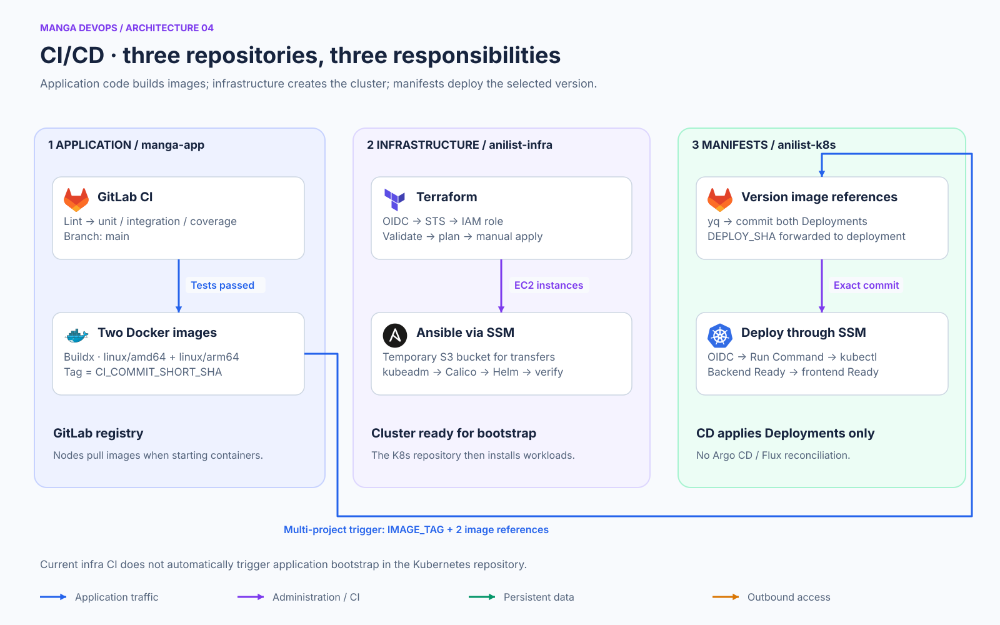
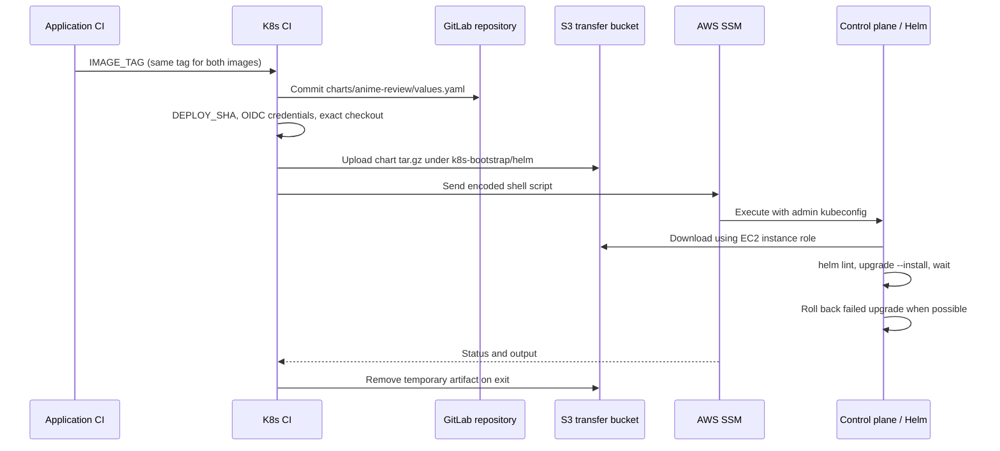

# Anime Review · Helm deployment on Kubernetes

This repository deploys the application as the **`anime-review` Helm release** on the AWS kubeadm cluster created by [anime-review-infra](https://github.com/Songhai9/anime-review-infra). [anime-review-app](https://github.com/Songhai9/anime-review-app) builds the frontend and backend images. The chart packages Deployments, Services, PostgreSQL, Ingress and NetworkPolicies into one versioned application definition.


## Navigation

- [Chart ownership and configuration](#chart-ownership-and-configuration)
- [Installation and delivery](#installation-and-delivery)
- [CI/CD with S3 and SSM](#cicd-with-s3-and-ssm)
- [Configuration, IAM and tokens](docs/CONFIGURATION.md)
- [Operations, migration and rollback](docs/OPERATIONS.md)

## Implemented features

- Local application chart at `charts/anime-review`, type `application`, chart version `0.1.0`, metadata `appVersion: 1.0.0`. The image tags in `values.yaml`, not `appVersion`, select executable code.
- Two backend replicas and one frontend replica by default; configurable images, resource requests/limits, service ports and replica counts. Frontend requests reach the API server-side.
- PostgreSQL 16 Alpine StatefulSet with one replica, a headless Service, application Service and an 8 GiB RWO gp3 claim. The external StorageClass has `WaitForFirstConsumer` and `Retain`.
- Health/readiness probes and SQL credentials referenced from an existing Secret. PostgreSQL data is mounted below `PGDATA=/var/lib/postgresql/data/pgdata`.
- Optional Ingress and optional ingress NetworkPolicies through values. Default traffic is ingress-nginx → frontend:3000 → backend:3001 → PostgreSQL:5432. Egress is not denied.
- GitLab CI changes both image tags in chart values, commits the change, packages the exact Git revision, transfers it through S3 and runs Helm on the control plane through SSM.
- A deployment resource group serializes jobs in this K8s project. Helm waits for readiness and requests rollback on upgrade failure.

## Chart ownership and configuration

| Managed by the application release | Prepared separately |
|---|---|
| Backend/frontend Deployments and Services | AWS infrastructure, kubeadm, Calico and Helm |
| PostgreSQL StatefulSet and its two Services | EBS CSI, ingress-nginx and metrics-server releases |
| Ingress when enabled | `anime-review` namespace |
| Four NetworkPolicies when enabled | `postgres-secrets`, registry pull Secret/ServiceAccount |
| PostgreSQL volume claim template | Cluster-scoped gp3 StorageClass |

The chart renders **12 Kubernetes objects** with default values. Namespace, SQL Secret and StorageClass remain outside its ownership. Add-on chart versions remain in `install_addons.sh`: EBS CSI 2.66.0, ingress-nginx 4.15.1, metrics-server 3.14.0.

Use `charts/anime-review/values.yaml` for the desired state consumed by CI. A supplied [override example](docs/examples/helm-values.yaml.example) illustrates the supported settings; it contains no password. There is no values schema or chart test hook in this revision. Resource names and tier labels are fixed, so this chart is not designed for multiple independent releases in the same namespace. Changing service ports does not automatically reconfigure Node or PostgreSQL listening ports; keep the implemented defaults unless the applications are changed too.

Helm reduces repeated YAML editing, versions release state and applies related resources together. Raw manifests are simpler for a small fixed installation, while Kustomize provides overlays without release management. Here Helm is useful because image versions, replicas and configuration are centralized and upgrades have release history. It does not add a continuously reconciling GitOps controller or roll back SQL data.

## Installation and delivery

### 1. Gather prerequisites

- Three Ready nodes, Calico, Helm 4, a reachable NLB and functioning AWS SSM access.
- Published ARM64 backend/frontend images from the same application commit. The default tag `204a33c5` must be replaced if unavailable.
- SecureString `/anime-review/postgres/password` in eu-north-1, readable/decryptable by the control-plane identity.
- Private-registry credentials when images require authentication.
- Cluster access through `/etc/kubernetes/admin.conf` on the control plane. CI additionally requires the transfer-bucket IAM permissions described in [CONFIGURATION](docs/CONFIGURATION.md).


### 2. Open a session and prepare tools

From the infra repository root on your workstation:

```bash
CONTROL_PLANE_ID=$(terraform -chdir=terraform output -raw control_plane_instance_id)
aws ssm start-session --target "$CONTROL_PLANE_ID" --region eu-north-1
```

Inside the remote machine's session:

```bash
sudo -i
export KUBECONFIG=/etc/kubernetes/admin.conf
export AWS_REGION=eu-north-1
export AWS_DEFAULT_REGION=eu-north-1
kubectl get nodes -o wide
helm version
command -v aws
```

The current infrastructure playbook installs ARM64 AWS CLI v2 at `/usr/local/bin/aws` if absent. On an older cluster, install it before continuing. Helm must support the Helm 4 flags used below; check `helm version` and `helm upgrade --help`.

Verify identity and parameter access without printing the secret:

```bash
aws sts get-caller-identity
aws ssm get-parameter --name /anime-review/postgres/password \
  --with-decryption --region eu-north-1 --query Parameter.Name --output text
```

The control-plane instance profile already includes Parameter Store access through `AmazonSSMManagedInstanceCore`. For access failures, also inspect KMS/SCP rules rather than automatically adding broad permissions. Do not copy permanent workstation AWS keys onto the VM.

### 3. Retrieve the chart and set desired images

On the control plane, in your administration directory:

```bash
git clone https://github.com/Songhai9/anime-review-k8s.git
cd anime-review-k8s
# Optional: reproduce the documented snapshot before making local edits.
git checkout 0da79c681230ac9ff51b81abcd21c9d08ecdb7e0
```

Use your fork when appropriate. Edit both `backend.image` and `frontend.image` in `charts/anime-review/values.yaml`, keeping repository and tag separate and tags quoted as strings. For routine CI, commit the repository paths and other desired settings to GitLab: the update job changes **tags only**. It ignores the `BACKEND_IMAGE` and `FRONTEND_IMAGE` variables still forwarded by application CI.

For a manual deployment, copy `docs/examples/helm-values.yaml.example` to a private operator directory, fill it in and pass it using `-f`. Neither bootstrap nor CI automatically reads that example. The procedure below uses the chart's edited default values to match CI behavior.

```bash
helm lint ./charts/anime-review
helm template anime-review ./charts/anime-review \
  --namespace anime-review > /tmp/anime-review-rendered.yaml
```

Inspect the rendered images, namespace, database settings and PVC template before cluster changes. Templates are not plain manifests: do not pass `charts/anime-review/templates` directly to `kubectl apply`.

### 4. Private registry access

Skip this step only if images are public and genuinely accessible anonymously. Otherwise, create the namespace, then the Secret, and associate it with the ServiceAccount used by pods:

```bash
kubectl apply -f namespace/anime-review.yaml
read -r -p 'Deploy token username: ' REGISTRY_USER
read -r -s -p 'read_registry deploy token: ' REGISTRY_PASSWORD
printf '\n'
kubectl create secret docker-registry gitlab-registry \
  --namespace anime-review \
  --docker-server=registry.gitlab.com \
  --docker-username="$REGISTRY_USER" \
  --docker-password="$REGISTRY_PASSWORD" \
  --dry-run=client -o yaml | kubectl apply -f -
unset REGISTRY_PASSWORD
kubectl patch serviceaccount default -n anime-review \
  --type=merge -p '{"imagePullSecrets":[{"name":"gitlab-registry"}]}'
```

The association applies to newly created pods using the default ServiceAccount. Recreate existing pods through a controlled rollout after fixing the configuration. This command replaces the `imagePullSecrets` list; preserve any other entries in an existing environment. The optional manifest under `docs/examples/` documents the same association; bootstrap does not load it automatically.

### 5. Prepare external resources and install the release

Run from the K8s repository root on the control plane. This expands bootstrap into explicit steps and replaces its incompatible Helm flag. If this cluster already runs the former raw manifests, follow [the migration procedure](docs/OPERATIONS.md#migrate-existing-raw-manifests) before installing Helm; do not delete the database to solve an ownership error.

```bash
set -euo pipefail
bash ./install_addons.sh
kubectl apply -f namespace/anime-review.yaml
POSTGRES_PASSWORD=$(aws ssm get-parameter \
  --name /anime-review/postgres/password --with-decryption \
  --query Parameter.Value --output text --region eu-north-1)
if [ -z "$POSTGRES_PASSWORD" ] || [ "$POSTGRES_PASSWORD" = None ]; then
  echo "PostgreSQL password is missing" >&2
  exit 1
fi
kubectl create secret generic postgres-secrets -n anime-review \
  --from-literal=POSTGRES_PASSWORD="$POSTGRES_PASSWORD" \
  --dry-run=client -o yaml | kubectl apply -f -
unset POSTGRES_PASSWORD
kubectl apply -f storage/gp3-storageclass.yaml
helm upgrade --install anime-review ./charts/anime-review \
  --namespace anime-review --server-side=true \
  --wait --rollback-on-failure --timeout 5m
helm status anime-review --namespace anime-review
```

Run command blocks in a shell that stops on errors (`set -euo pipefail`), and stop if retrieving the parameter fails. A Helm upgrade covers all chart resources, rather than applying backend and frontend sequentially. Readiness probes provide dependency gating. The surrounding add-on/Secret/StorageClass preparation is not one atomic transaction with the release. Updating the Secret does not rotate an existing PostgreSQL SQL role.

### 6. Check networking, application and data

```bash
kubectl get nodes -o wide
helm list -n kube-system
helm list -n ingress-nginx
kubectl -n anime-review get pods,svc,ingress,pvc
kubectl get pv
kubectl -n anime-review get networkpolicy
kubectl -n anime-review rollout status statefulset/postgres --timeout=180s
kubectl -n anime-review rollout status deployment/backend-deployment --timeout=180s
kubectl -n anime-review rollout status deployment/frontend-deployment --timeout=180s
```

From the workstation, in the infra repository:

```bash
NLB_DNS=$(terraform -chdir=terraform output -raw nlb_dns_name)
curl --fail "http://$NLB_DNS/health"
```

Open `http://NLB_DNS`, create a reader, add a title and save a review. This crosses NLB, Ingress, frontend, API and DB. The API has no dedicated public route. A 200 from frontend `/health` alone does not validate the entire path; also perform a functional write/read.

Allowed ingress is: selected ingress-nginx pods → frontend:3000; frontend → backend:3001; backend → DB:5432. Cluster DNS resolves Service names. These policies do not block outbound AniList or registry access.

## CI/CD with S3 and SSM



### Configure GitLab

1. Set `AWS_ROLE_ARN` to the infra `k8s_cd_arn` output; trust must match the K8s project, `main` and audience `sts.amazonaws.com`.
2. Set `K8S_TRANSFER_BUCKET` to the actual existing bucket. Align it with infra `k8s_transfer_bucket_name`; CI's default is project-specific.
3. Allow the app project to trigger K8s and allow this K8s project's own job token to push to its protected branch as intended.
4. Commit actual image repository paths in chart values. The app supplies `IMAGE_TAG`; the current K8s update job writes it to both tags.
5. Complete initial namespace, secrets, storage and add-on preparation before routine delivery.

| Trigger | Update job | Deployment job |
|---|---|---|
| Multi-project pipeline with nonempty `IMAGE_TAG` | Updates chart tags, commits if changed, emits `DEPLOY_SHA` | Deploys the selected commit |
| Push to K8s `main` | Skipped | Deploys `CI_COMMIT_SHA` |
| Infra pipeline with only `BOOTSTRAP_CLUSTER=true` | No matching rule | No matching rule |
| UI/manual pipeline with no matching source rule | No matching rule | No matching rule |

`BOOTSTRAP_CLUSTER` does not currently enable bootstrapping. Do not infer behavior from its name. The infra rebuild trigger needs corresponding downstream implementation before it provides an end-to-end fresh-cluster workflow.

### Exact delivery sequence



The archive contains `charts/anime-review` only. This is a temporary tar archive, not an OCI chart publication or signed Helm package. CI does not send raw Deployment YAML or clone the repository on the node. The control plane must have `/usr/local/bin/aws` and `/usr/local/bin/helm`.

The runner uploads `k8s-bootstrap/helm/CI_PIPELINE_ID/DEPLOY_SHA.tar.gz`, invokes SSM and polls up to 90 times with five-second sleeps (roughly 7.5 minutes plus API latency). A Helm operation, rollback and transfer may exceed that window. On timeout, inspect the existing SSM command before retrying. The EXIT trap attempts S3 deletion even on failure; hard cancellation may leave artifacts. On versioned buckets, deletion can leave earlier object versions for lifecycle cleanup. Remote temporary files are removed after successful completion; earlier errors can leave them behind.

`resource_group: anime-review-cluster` serializes deploy jobs in this project, not manual Helm operations, infra jobs or the tag-update jobs. Concurrent tag commits can still race. EC2 discovery selects the first running instance named `anime-review-control-plane`; ensure that target is unique.

### Updating more than images

Commit chart values/templates to K8s `main`; the deployment job upgrades the whole chart, including Services, Ingress, policies and StatefulSet. Changes to add-ons, namespace, secrets and StorageClass remain separate operator actions. CI has no rendering/test job before upload: `helm lint` runs remotely immediately before upgrade.
